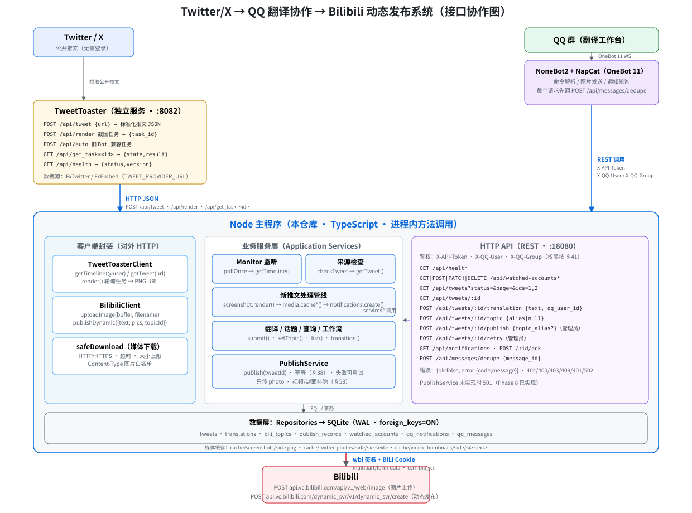

# SekaiBridge（世界桥）

PJSK 推文搬运系统：自动监听 Twitter/X 账户 → 新推文截图并通知 QQ 群 → 群成员提交最终翻译 → 管理员发布到 Bilibili 动态（含原图与话题）。

> 名字寓意：连接 Twitter/X 世界与 Bilibili 的"世界"（Project Sekai）的桥梁。

- 详细部署参考：[`docs/DEPLOYMENT.md`](docs/DEPLOYMENT.md)

> 本系统面向 **Linux 服务器（Docker）** 部署，不支持 Windows 部署。

---

## 架构



```text
Twitter/X ──► TweetToaster ──► app（主程序，Node + SQLite，:18080）
                                        │  HTTP API
QQ 群 ◄──► NoneBot2 ◄──NapCat(Linux QQ) ◄┘   │
                                        ▼
                                     Bilibili（发布动态）
```

四个容器服务：`app`（主程序）、`tweettoaster`（Twitter 数据/截图）、`napcat`（Linux QQ 无头 + OneBot）、`nonebot2`（QQ 命令/通知）。

---

## 快速开始（Linux，约 10 分钟）

### 第 0 步：环境

- Linux 服务器（Ubuntu 20+/Debian 10+/CentOS 9），有公网或可访问网络
- 已安装 Docker Engine + Docker Compose v2

### 第 1 步：获取代码与配置

```bash
git clone https://github.com/LinQi2333/SekaiBridge.git
cd SekaiBridge
cp .env.example .env
vim .env   # 填入下面的配置
```

`.env` 必填项：

| 变量 | 说明 |
| --- | --- |
| `QQ_GROUP_IDS` | 机器人要工作的 QQ 群号（逗号分隔，如 `123456789`） |
| `QQ_ADMIN_IDS` | 管理员 QQ 号（逗号分隔；管理员才能 `/发布` `/重试` `/监听`） |
| `API_TOKEN` | 内部 API 密钥（`openssl rand -hex 32` 生成，NoneBot2 与主程序共用） |
| `BILI_SESSDATA` / `BILI_JCT` / `BILI_DEDEUSERID` | Bilibili 发布账号 Cookie（获取方法见下方"Bilibili Cookie"） |

### 第 2 步：一键启动

```bash
./start.sh
```

脚本会构建并启动全部 4 个服务，然后显示状态：

```text
===== 服务状态 =====
NAME             IMAGE                             STATUS          PORTS
app              twitter-qq-bilibili-app           Up ...          127.0.0.1:18080->18080/tcp
tweettoaster     ghcr.io/cn-matsuri/tweettoaster   Up ...          ...
napcat           mlikiowa/napcat-docker            Up ...          0.0.0.0:3001->3001/tcp, 0.0.0.0:6099->6099/tcp
nonebot2         twitter-qq-bilibili-nonebot2      Up ...          ...
===== 健康检查 =====
✔ 主程序 /api/health: OK ...
```

### 第 3 步：登录机器人 QQ

NapCat 里的 QQ 需要登录一次（Linux 下为 WebUI 扫码登录）：

```bash
./start.sh status        # 查看 WebUI token（或 docker compose logs napcat | grep -i token）
```

浏览器打开 `http://<服务器IP>:6099/webui` → 输入 token → 扫码登录机器人 QQ（手机 QQ 确认）。

> 若 OneBot WS（3001）未监听：WebUI → 网络配置 → 新建 WebSocket 服务，端口 `3001`。

### 第 4 步：验证

```bash
curl http://127.0.0.1:18080/api/health
# {"ok":true,"data":{"status":"ok","database":"ok","tweettoaster":"ok","qq":"external"}}
```

在群里发 `/列表`，机器人应回复任务列表。

### 第 5 步：开始使用

群内添加监听账户（管理员）：

```text
/监听 添加 @某账号
```

首次添加会自动记录历史推文（不刷屏）；之后新推文 → 截图 → 自动通知进群 → 翻译 → 话题 → 发布。

---

## 配置详解

`.env` 完整变量（其余可留默认）：

| 变量 | 默认值 | 说明 |
| --- | --- | --- |
| `NODE_ENV` | `production` | 运行环境 |
| `DATABASE_PATH` | `/app/data/app.db` | SQLite 路径（容器内） |
| `CACHE_ROOT` | `/app/cache` | 媒体缓存目录（容器内） |
| `TWEETTOASTER_URL` | `http://tweettoaster:8082` | TweetToaster 地址（compose 内网） |
| `TWITTER_POLL_INTERVAL` | `60` | 监听轮询间隔（秒，每账户 ±10s jitter） |
| `SOURCE_CHECK_INTERVAL` | `1800` | 原推删除检查间隔（秒） |
| `BOOTSTRAP_MODE` | `latest_only` | 首次监听只记录不通知 |
| `QQ_GROUP_IDS` | 空 | 允许的群号，逗号分隔（必填） |
| `QQ_ADMIN_IDS` | 空 | 管理员 QQ，逗号分隔（必填） |
| `BILI_*` | 空 | Bilibili 发布账号 Cookie（必填，见下） |
| `PUBLISH_MODE` | `manual` | 发布模式（仅 manual） |
| `API_PORT` | `18080` | 主程序 HTTP API 端口 |
| `API_TOKEN` | 空 | 内部 API 密钥（必填） |

### Bilibili Cookie 获取

1. 浏览器登录 `https://www.bilibili.com`（用于发布的账号）
2. `F12` → `Application` → `Cookies` → `https://www.bilibili.com`
3. 复制 `SESSDATA`（URL 编码形式，不要点"显示已解码"）、`bili_jct`、`DedeUserID` 填入 `.env`

验证：`curl -s 'https://api.bilibili.com/x/web-interface/nav' -H 'Cookie: SESSDATA=...; bili_jct=...; DedeUserID=...'` 返回 `"isLogin":true` 即有效。

---

## 使用（QQ 群命令）

| 命令 | 权限 | 说明 |
| --- | --- | --- |
| `/监听` | 管理员 | 查看 / `添加 @账号` / `开启` / `关闭` / `删除` |
| `/列表 [状态] [页码]` | 成员 | 任务列表（每条含内容摘要）；状态：待翻译/已翻译/已发布/失败/全部 |
| `/查看 152,155` | 成员 | 推文状态 + 原推链接 + 截图 |
| `/翻译 152` + 正文 | 成员 | 提交最终翻译（保留 emoji/换行，版本递增） |
| `/话题 152 别名` | 成员 | 设置话题；`无` 取消（话题需管理员先在库中配置） |
| `/发布 152 [话题]` | 管理员 | 发布到 Bilibili（翻译 + 原图 + 话题） |
| `/重试 152` | 管理员 | 发布失败后重试 |

新推文自动通知：进群推文截图（视频推文含封面与"包含视频"提示），**不含原文正文**。

---

## 运维

```bash
./start.sh status     # 查看 4 个服务状态 + 健康检查
./start.sh logs       # 跟随全部日志（可加服务名：./start.sh logs app）
./start.sh stop       # 停止（保留数据）
./start.sh restart    # 重启
./start.sh down       # 停止并删除容器（数据卷保留）
```

- **备份**：数据库在 volume `app-data`（`/app/data/app.db`）。备份：`docker compose exec app sh -c 'cd /app/data && sqlite3 app.db ".backup /backup.db"'` 后拷贝。
- **缓存**：volume `app-cache`，可安全清空。
- **Cookie 失效**：`/发布` 返回 `BILIBILI_AUTH` → 更新 `.env` 的 `BILI_*` → `./start.sh restart` → 群内 `/重试`。
- **更新**：`git pull && ./start.sh`。
- **Bilibili 必须直连**（程序已处理，勿为 B 站配代理）；Twitter 媒体走 `HTTPS_PROXY`（如需代理，在 `.env` 加 `HTTPS_PROXY=http://...`）。

---

## 目录

```text
src/           主程序（TypeScript）
  config/ db/ domain/ repositories/ services/ tweettoaster/ media/ api/ bilibili/
nonebot-plugin/ NoneBot2 插件（容器化）
docs/          部署文档与架构图
data/ cache/   运行时数据（Docker volume）
docker-compose.yml  全栈编排
start.sh       一键启动/状态/日志/停止
```
