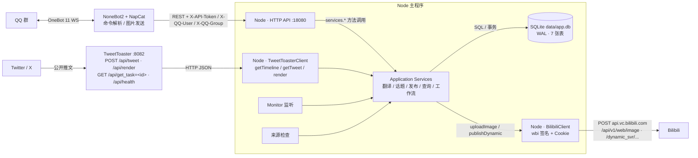

# 部署说明书

Twitter/X → QQ 翻译协作 → Bilibili 动态发布系统（MVP）

适用版本：Phase 1-10（`twitter_qq_bilibili_solution_v0.3.md` 全部实现）

---

## 目录

1. [项目简介](#1-项目简介)
2. [架构总览](#2-架构总览)
3. [环境要求](#3-环境要求)
4. [前置依赖获取](#4-前置依赖获取)
5. [配置详解](#5-配置详解)
6. [部署步骤](#6-部署步骤)
7. [NoneBot2 插件接入（参考实现）](#7-nonebot2-插件接入参考实现)
8. [运维指南](#8-运维指南)
9. [常见问题 FAQ](#9-常见问题-faq)
10. [安全清单](#10-安全清单)
11. [MVP 验收清单](#11-mvp-验收清单)

---

## 1. 项目简介

自动监听 Twitter/X 指定账户 → 新推文生成截图并通知 QQ 群 →
群成员讨论翻译 → 通过机器人命令提交最终翻译 → 管理员确认后发布到 Bilibili 动态。

核心设计：

- **QQ 是确定的工作平台**（NoneBot2 + NapCat），业务逻辑全部在 Node 服务端；
- Node 主程序提供内部 HTTP API，NoneBot2 与未来 Web 复用同一套 Application Services；
- 推文截图 ≠ Twitter 原图：截图发 QQ，原图用于 Bilibili 发布；
- 视频推文只下载默认封面、不转载视频本体；
- `source_status`（原推是否删除）与 `workflow_status`（翻译/发布进度）两个维度分离。

---

## 2. 架构总览




**接口协作要点（各模块间的 API 关系）**

| 调用方向 | 协议 / 接口 | 关键参数与鉴权 |
| --- | --- | --- |
| Node → TweetToaster | `POST /api/tweet` | body `{url}`（单推链接 / @用户名 / 主页），返回标准化推文 JSON；404 → `TweetNotFoundError`（SOURCE_DELETED 信号） |
| Node → TweetToaster | `POST /api/render` | body `{tweet, template:"", logo:"none", noLikes:true, selection:[{id}]}` → `{task_id}`；轮询 `GET /api/get_task=<id>` 至 `SUCCESS`，取 `result` 拼 `/cache/<result>.png` |
| Node → TweetToaster | `GET /api/health` | 健康检查，聚合进 `/api/health` |
| NoneBot2 → Node | REST `GET/POST/PATCH/DELETE /api/...` | 头：`X-API-Token`（= `API_TOKEN`）、`X-QQ-User`、`X-QQ-Group`；权限按 §41（管理员 / 成员 / 群白名单） |
| NoneBot2 → Node | `GET /api/notifications` + `POST /api/notifications/:id/ack` | token 鉴权；返回待发送通知（文本 + 截图路径 + 视频封面路径） |
| NoneBot2 → Node | `POST /api/messages/dedupe` | body `{message_id}` → `{duplicate:bool}`（§43 消息去重） |
| Node → Bilibili | `POST api.bilibili.com/x/dynamic/feed/draw/upload_bfs` | multipart `file_up` + `category=daily` + `csrf=bili_jct` + Cookie → `data.image_url`（旧接口 `api/vc.bilibili.com/api/v1/web/image` 已下线） |
| Node → Bilibili | `POST api.vc.bilibili.com/dynamic_svr/v1/dynamic_svr/create` | form `type=4, biz_id=pics[], content, topic_id?, csrf=bili_jct` + wbi 签名 → `data.dynamic_id` |
| Node 内部 | 服务 → 客户端 / Repositories | 进程内 TS 方法调用；Repositories → SQLite（WAL、`foreign_keys=ON`） |

| 组件 | 职责 | 部署方式 |
| --- | --- | --- |
| **TweetToaster** | Twitter/X 数据获取（FxTwitter/FxEmbed）、推文截图渲染（Chromium） | Docker 官方镜像（推荐）或源码 |
| **Node 主程序** | 监听、截图下载、媒体缓存、来源检查、翻译/话题/发布业务、HTTP API、SQLite | 本仓库（Docker 或 Node 直接运行） |
| **NoneBot2 + NapCat** | QQ 消息收发（OneBot 11）、命令解析、图片发送 | 独立部署（不放进容器） |
| **Bilibili** | 图片上传、动态发布（由 Node 通过 Cookie 调用） | 外部平台 |

---

## 3. 环境要求

### 3.1 服务器

| 项目 | 要求 |
| --- | --- |
| 操作系统 | Linux（推荐） / Windows / macOS |
| 内存 | ≥ 2 GB（Chromium 渲染 + Node） |
| 磁盘 | ≥ 10 GB（缓存图片、数据库） |
| 网络 | 可访问 x.com 数据源（TweetToaster 需要）、api.vc.bilibili.com、QQ 服务 |

### 3.2 运行时（二选一）

- **Docker 方式（推荐）**：Docker Engine ≥ 24 + Docker Compose v2
- **本机 Node 方式**：Node.js ≥ 22（22.5+），npm ≥ 10

### 3.3 外部账号

| 账号 | 用途 |
| --- | --- |
| Twitter/X 公开账户 | 仅需可公开访问（无需登录） |
| QQ 机器人号（小号） | 用于 NapCat 登录，进群发送通知 |
| Bilibili 账号 | 发布动态（需要 Cookie） |

---

## 4. 前置依赖获取

### 4.1 TweetToaster

**方式 A：Docker 官方镜像（推荐）**

```bash
docker run -d \
  --name tweettoaster \
  --restart unless-stopped \
  --shm-size=512m \
  -p 127.0.0.1:8082:8082 \
  -v tweet-cache:/app/Matsuri_translation/frontend/cache \
  ghcr.io/cn-matsuri/tweettoaster:latest
```

验证：

```bash
curl http://127.0.0.1:8082/api/health
# → {"status":"ok","version":"2.0.0"}
```

**方式 B：源码运行**（Node.js 22+ 且本机有 Chrome/Chromium）

```bash
git clone https://github.com/cn-matsuri/TweetToaster
cd TweetToaster && pnpm install
pnpm start   # 默认 8082
```

> 说明：主程序只调用 TweetToaster 的 `POST /api/tweet`、`POST /api/render`、`GET /api/get_task=<id>`、`GET /api/health`，不直接抓取 Twitter（规格 §14）。

### 4.2 QQ 侧：NapCat + NoneBot2

本方案中 **NoneBot2（Python）负责 QQ 消息收发**，NapCat 是 OneBot 11 协议实现。

**NapCat（QQ 协议端）**

1. 从 [NapCatQQ 官方发布页](https://github.com/NapNeko/NapCatQQ/releases) 下载对应平台的安装包；
2. 使用**机器人 QQ 小号**登录 NapCat；
3. 打开 NapCat 面板 → 网络配置 → 添加 **WebSocket 服务端（正向 WS）**，端口建议 `3001`，Access Token 可留空（主程序不直连 NapCat，token 由 NoneBot2 侧管理）；
4. 记录：
   - **QQ 群号**：机器人所在群的群号（`QQ_GROUP_IDS`）；
   - **管理员 QQ 号**：你自己的 QQ 号（`QQ_ADMIN_IDS`）。

**NoneBot2（Bot 框架）**

```bash
# Python ≥ 3.10
pip install nonebot2[fastapi] nonebot-adapter-onebot
```

创建机器人项目并配置连接 NapCat（WebSocket 反向连接地址：`ws://127.0.0.1:3001`），具体步骤见 [NoneBot2 文档](https://nonebot.dev/)。插件参考实现见本文档第 7 节。

> 说明：部署时 QQ 侧独立于主程序运行（规格 §58），不要把 QQ 客户端塞进主应用容器。

### 4.3 Bilibili Cookie（重点）

发布动态与图片上传需要 Bilibili 登录态，通过 Cookie 传递（规格 §40）。**需要三个值**：

| 名称 | 说明 | 示例 |
| --- | --- | --- |
| `SESSDATA` | 登录会话凭证 | `abcdef1234%2C1728000000%2C12345*81` |
| `bili_jct` | CSRF 校验值 | `9f8e7d6c5b4a3210` |
| `DedeUserID` | 用户 UID | `12345678` |

**获取步骤（Chrome / Edge）**

1. 用**用于发布的 Bilibili 账号**登录 `https://www.bilibili.com`；
2. 按 `F12` 打开开发者工具 → `Application`（应用）面板；
3. 左侧 `Storage → Cookies → https://www.bilibili.com`；
4. 在列表中分别找到 `SESSDATA`、`bili_jct`、`DedeUserID`，**双击 Value 列复制完整值**（SESSDATA 很长，注意复制完整）；
5. 填入 `.env` 的 `BILI_SESSDATA=`、`BILI_JCT=`、`BILI_DEDEUSERID=`。

**验证 Cookie 是否有效**（命令行）：

```bash
curl -s 'https://api.bilibili.com/x/web-interface/nav' \
  -H 'Cookie: SESSDATA=你的SESSDATA; bili_jct=你的bili_jct; DedeUserID=你的DedeUserID'
# 返回 {"code":0,...,"data":{"isLogin":true,...}} 表示有效
# code:-101 表示未登录 / Cookie 失效
```

**注意事项（安全）**

- Cookie 等同账号密码，**不要提交到 Git、不要发到群里、不要贴进日志**（程序也不会打印）；
- SESSDATA 可能被 Bilibili 定期失效（常见几周到几个月），失效后发布会报 `BILIBILI_AUTH`，按第 8 节"Cookie 失效处理"更新；
- 频繁异常操作可能触发风控（code `-352`），建议发布频率保持正常人类水平；
- 建议使用**专用小号**发布，不要用主账号。

### 4.4 API_TOKEN 生成

主程序 HTTP API 的共享密钥（NoneBot2 调用时放在 `X-API-Token` 头）：

```bash
# Linux / macOS
openssl rand -hex 32
# Windows PowerShell
[System.Security.Cryptography.RandomNumberGenerator]::GetBytes(32) | ForEach-Object { $_.ToString('x2') } -join ''
```

得到一个 64 位十六进制字符串，填入 `.env` 的 `API_TOKEN=`。

---

## 5. 配置详解

配置文件为项目根目录 `.env`（从 `.env.example` 复制）。**所有 secret 只允许出现在这里**。

| 变量 | 默认值 | 必填 | 说明 |
| --- | --- | --- | --- |
| `NODE_ENV` | `production` | 否 | `production` / `development` / `test` |
| `DATABASE_PATH` | `./data/app.db` | 否 | SQLite 文件路径（Docker 内 `/app/data/app.db`） |
| `CACHE_ROOT` | `./cache` | 否 | 媒体缓存根目录（截图 / 原图 / 视频封面） |
| `TWEETTOASTER_URL` | `http://tweettoaster:8082` | 是 | TweetToaster 地址（本机运行改为 `http://127.0.0.1:8082`） |
| `TWITTER_POLL_INTERVAL` | `60` | 否 | 监听轮询间隔（秒）；每账户附加 ±10s jitter |
| `SOURCE_CHECK_INTERVAL` | `1800` | 否 | 原推删除检查间隔（秒），默认 30 分钟 |
| `BOOTSTRAP_MODE` | `latest_only` | 否 | 首次监听行为（仅 `latest_only`：只入库不刷历史） |
| `QQ_GROUP_IDS` | 空 | 是 | 允许接收消息的 QQ 群号，逗号分隔，如 `10001,10002` |
| `QQ_ADMIN_IDS` | 空 | 是 | 管理员 QQ 号，逗号分隔，如 `20001,20002` |
| `BILI_SESSDATA` | 空 | 是（要发布） | Bilibili 登录 Cookie |
| `BILI_JCT` | 空 | 是（要发布） | Bilibili CSRF Cookie |
| `BILI_DEDEUSERID` | 空 | 是（要发布） | Bilibili UID |
| `PUBLISH_MODE` | `manual` | 否 | 发布模式（仅 `manual`：人工确认） |
| `API_PORT` | `18080` | 否 | HTTP API 端口（NoneBot2 / Web 调用） |
| `API_TOKEN` | 空 | 强烈建议 | HTTP API 共享密钥（NoneBot2 用 `X-API-Token` 携带） |

> 未使用的旧变量：`ONEBOT_WS_URL` / `ONEBOT_ACCESS_TOKEN` 在本方案（NoneBot2 收发 QQ 消息）下不再使用，可留空。

### 5.1 生产环境示例 `.env`

```env
NODE_ENV=production

DATABASE_PATH=./data/app.db
CACHE_ROOT=./cache

TWEETTOASTER_URL=http://tweettoaster:8082
TWITTER_POLL_INTERVAL=60
SOURCE_CHECK_INTERVAL=1800
BOOTSTRAP_MODE=latest_only

# QQ 群：机器人所在群；管理员：负责 /监听 /发布 /重试 的人
QQ_GROUP_IDS=10001,10002
QQ_ADMIN_IDS=20001

# Bilibili 发布账号 Cookie（获取方式见 4.3）
BILI_SESSDATA=你的SESSDATA
BILI_JCT=你的bili_jct
BILI_DEDEUSERID=你的DedeUserID

PUBLISH_MODE=manual

# HTTP API（NoneBot2 调用）
API_PORT=18080
API_TOKEN=你的64位随机hex
```

---

## 6. 部署步骤

### 6.1 Docker Compose 部署（推荐）

```bash
# 1. 克隆 / 拷贝项目
git clone <你的仓库地址> twitter-qq-bilibili
cd twitter-qq-bilibili

# 2. 创建配置
cp .env.example .env
# 编辑 .env，填入第 5 节内容（QQ 群/管理员、Bili Cookie、API_TOKEN 必填）

# 3. 启动（首次会构建镜像并拉取 TweetToaster）
docker compose up -d --build

# 4. 查看日志确认启动成功
docker compose logs -f app
# 应看到：monitor started / source validation started / api listening on ...:18080

# 5. 健康检查
curl http://127.0.0.1:18080/api/health
# → {"ok":true,"data":{"status":"ok","database":"ok","tweettoaster":"ok","qq":"external"}}
```

**常用命令**

```bash
docker compose ps              # 服务状态
docker compose logs -f app     # 主程序日志
docker compose pull            # 更新 TweetToaster 镜像
docker compose up -d --build   # 更新主程序
docker compose down            # 停止（保留数据卷）
docker compose down -v         # 停止并删除数据（慎用！会清空数据库）
```

### 6.2 本机直接运行（开发 / 无 Docker）

```bash
# 1. 安装依赖并构建
npm install
npm run build

# 2. 配置 .env（同上；TWEETTOASTER_URL 改为 http://127.0.0.1:8082）

# 3. 运行
npm start            # node dist/index.js
# 或开发模式
npm run dev          # tsx watch

# 4. 健康检查
curl http://127.0.0.1:18080/api/health
```

### 6.3 可选：systemd 服务（Linux 本机部署）

`/etc/systemd/system/twitter-qq-bilibili.service`：

```ini
[Unit]
Description=Twitter QQ Bilibili Publisher
After=network.target

[Service]
WorkingDirectory=/opt/twitter-qq-bilibili
ExecStart=/usr/bin/node dist/index.js
Restart=always
RestartSec=5
EnvironmentFile=/opt/twitter-qq-bilibili/.env

[Install]
WantedBy=multi-user.target
```

```bash
sudo systemctl daemon-reload
sudo systemctl enable --now twitter-qq-bilibili
```

---

## 7. NoneBot2 插件接入（参考实现）

NoneBot2 插件负责：**收到群命令 → 调用主程序 HTTP API → 把结果发回群里**，以及**轮询新推文通知并发送**。

### 7.1 插件代码示例

`plugins/twitter_qq_bili/__init__.py`：

```python
"""Twitter→QQ→Bilibili 发布系统 NoneBot2 插件（参考实现）。"""
import httpx
from nonebot import on_command
from nonebot.adapters.onebot.v11 import Bot, GroupMessageEvent, Message, MessageSegment
from nonebot.rule import to_me

API_BASE = "http://127.0.0.1:18080"      # Node 主程序地址
API_TOKEN = "你的64位随机hex"             # 与 .env 的 API_TOKEN 一致

# 群内 @机器人 或直接命令均可（去掉 to_me() 则不要求 @）
watch = on_command("监听", priority=1)
tweet_list = on_command("列表", priority=1)
show = on_command("查看", priority=1)
translate = on_command("翻译", priority=1)
topic = on_command("话题", priority=1)
publish = on_command("发布", priority=1)
retry = on_command("重试", priority=1)


def headers(event: GroupMessageEvent) -> dict:
    return {
        "X-API-Token": API_TOKEN,
        "X-QQ-User": str(event.user_id),
        "X-QQ-Group": str(event.group_id),
    }


async def call(path: str, method: str = "GET", body: dict | None = None,
               event: GroupMessageEvent | None = None) -> dict:
    hdrs = headers(event) if event else {"X-API-Token": API_TOKEN}
    async with httpx.AsyncClient(base_url=API_BASE, headers=hdrs, timeout=30) as client:
        resp = await (client.get(path) if method == "GET" else client.post(path, json=body))
        return resp.json()


async def dedupe(event: GroupMessageEvent, message_id: int) -> bool:
    """QQ 消息去重（规格 §43）：重复消息返回 True，应直接忽略。"""
    data = await call("/api/messages/dedupe", "POST", {"message_id": str(message_id)}, event)
    return bool(data.get("data", {}).get("duplicate"))


async def send_result(bot: Bot, event: GroupMessageEvent, data: dict, path: str | None = None):
    """把 API 返回的 JSON 转成群内文本 + 截图图片。"""
    if not data.get("ok"):
        await bot.send(event, f"操作失败：{data['error']['message']}")
        return
    # 简单把 data 转文本；按需针对每个命令定制（见下）
    await bot.send(event, str(data["data"]))


# ---------- /监听（管理员） ----------
@watch.handle()
async def handle_watch(bot: Bot, event: GroupMessageEvent, args: Message = ...):
    if await dedupe(event, event.message_id):
        return
    msg = args.extract_plain_text().strip()
    if not msg:
        data = await call("/api/watched-accounts", "GET", event=event)
    elif msg.startswith("添加"):
        screen = msg[2:].strip().lstrip("@")
        data = await call("/api/watched-accounts", "POST",
                          {"screen_name": screen}, event)
    elif msg.startswith("开启"):
        data = await call(f"/api/watched-accounts/{msg[2:].strip().lstrip('@')}", "PATCH",
                          {"enabled": True}, event)
    elif msg.startswith("关闭"):
        data = await call(f"/api/watched-accounts/{msg[2:].strip().lstrip('@')}", "PATCH",
                          {"enabled": False}, event)
    elif msg.startswith("删除"):
        data = await call(f"/api/watched-accounts/{msg[2:].strip().lstrip('@')}", "DELETE", event=event)
    else:
        await bot.send(event, "用法：/监听 | /监听 添加 @foo | /监听 开启 @foo | /监听 关闭 @foo | /监听 删除 @foo")
        return
    await send_result(bot, event, data)


# ---------- /查看 ----------
@show.handle()
async def handle_show(bot: Bot, event: GroupMessageEvent, args: Message = ...):
    if await dedupe(event, event.message_id):
        return
    ids = args.extract_plain_text().strip().replace("，", ",").replace(" ", ",")
    data = await call(f"/api/tweets?ids={ids}", "GET", event=event)
    if not data.get("ok"):
        await bot.send(event, f"操作失败：{data['error']['message']}")
        return
    result = data["data"]
    lines = []
    for t in result["tweets"]:
        lines.append(f"#{t['id']} @{t['authorScreenName']}  工作状态：{t['workflowStatus']}")
    if result["missing"]:
        lines.append("未找到：" + ",".join(f"#{i}" for i in result["missing"]))
    await bot.send(event, "\n".join(lines) or "没有找到推文")
    # 单条时附带截图：tweet 对象里 screenshotPath 是 Node 服务器上的路径，
    # 若 NoneBot2 与 Node 同机，可直接读文件发送；否则需要另行提供图片下载端点


# ---------- /翻译 ----------
@translate.handle()
async def handle_translate(bot: Bot, event: GroupMessageEvent, args: Message = ...):
    if await dedupe(event, event.message_id):
        return
    text = args.extract_plain_text().strip()
    # 格式：/翻译 152\n翻译内容...（第一行是编号，其余是正文）
    first_line, _, content = text.partition("\n")
    tweet_id = first_line.strip().split()[0]
    if not tweet_id.isdigit() or not content.strip():
        await bot.send(event, "用法：/翻译 <编号>\n翻译内容...")
        return
    data = await call(f"/api/tweets/{tweet_id}/translation", "POST",
                      {"text": content, "qq_user_id": str(event.user_id)}, event)
    if data.get("ok"):
        tr = data["data"]["result"]["translation"]
        await bot.send(event,
                       f"推文 #{tweet_id} 翻译已保存。\n\n当前版本：v{tr['version']}\n"
                       f"状态：已翻译，等待发布。\n\n可继续：\n/话题 {tweet_id} hololive\n/发布 {tweet_id}")
    else:
        await bot.send(event, f"操作失败：{data['error']['message']}")


# ---------- /话题 ----------
@topic.handle()
async def handle_topic(bot: Bot, event: GroupMessageEvent, args: Message = ...):
    if await dedupe(event, event.message_id):
        return
    parts = args.extract_plain_text().strip().split()
    if len(parts) == 0:
        # 列出可用话题
        topics = await call("/api/tweets?status=all", "GET", event=event)  # 话题列表示例
        await bot.send(event, "可用话题需查询话题管理接口（当前 MVP 由数据库配置）")
        return
    tweet_id, alias = parts[0], parts[1] if len(parts) > 1 else ""
    if not tweet_id.isdigit():
        await bot.send(event, "用法：/话题 <编号> <别名|无>")
        return
    data = await call(f"/api/tweets/{tweet_id}/topic", "POST",
                      {"alias": None if alias in ("无", "") else alias}, event)
    await send_result(bot, event, data)


# ---------- /发布（管理员） ----------
@publish.handle()
async def handle_publish(bot: Bot, event: GroupMessageEvent, args: Message = ...):
    if await dedupe(event, event.message_id):
        return
    parts = args.extract_plain_text().strip().split()
    if not parts or not parts[0].isdigit():
        await bot.send(event, "用法：/发布 <编号> [话题别名]")
        return
    body = {"topic_alias": parts[1]} if len(parts) > 1 else {}
    data = await call(f"/api/tweets/{parts[0]}/publish", "POST", body, event)
    if data.get("ok"):
        record = data["data"]["result"]["record"]
        await bot.send(event, f"#{parts[0]} 已发布。\n\nBilibili Dynamic ID:\n{record['biliDynamicId']}")
    else:
        await bot.send(event, f"操作失败：{data['error']['message']}")


# ---------- /重试（管理员） ----------
@retry.handle()
async def handle_retry(bot: Bot, event: GroupMessageEvent, args: Message = ...):
    if await dedupe(event, event.message_id):
        return
    tweet_id = args.extract_plain_text().strip()
    if not tweet_id.isdigit():
        await bot.send(event, "用法：/重试 <编号>")
        return
    data = await call(f"/api/tweets/{tweet_id}/retry", "POST", event=event)
    await send_result(bot, event, data)
```

### 7.2 新推文通知轮询（另建一个插件或定时任务）

```python
"""轮询 /api/notifications 并发送到 QQ 群（规格 §42）。"""
import asyncio
import httpx

API_BASE = "http://127.0.0.1:18080"
API_TOKEN = "你的64位随机hex"
TARGET_GROUP = "10001"   # 发送目标群

async def poll_notifications(bot):
    while True:
        try:
            async with httpx.AsyncClient(base_url=API_BASE,
                                         headers={"X-API-Token": API_TOKEN}, timeout=10) as client:
                resp = await client.get("/api/notifications?limit=10")
                for n in resp.json()["data"]["notifications"]:
                    segments = [MessageSegment.text(n["text"])]
                    # 截图（若与 Node 同机可直接读文件；否则需要文件下载端点）
                    # segments.append(MessageSegment.image(f"file://{n['screenshotPath']}"))
                    # 视频封面
                    # for thumb in n.get("videoThumbnails", []):
                    #     segments.append(MessageSegment.image(f"file://{thumb}"))
                    await bot.send_group_msg(group_id=int(TARGET_GROUP), message=segments)
                    await client.post(f"/api/notifications/{n['id']}/ack")
        except Exception:
            pass
        await asyncio.sleep(2)   # 拉取间隔；也可用 nonebot_plugin_apscheduler

# 在 NoneBot2 启动时注册：on_bot_connect 事件里 asyncio.create_task(poll_notifications(bot))
```

> **文件传输说明**：通知接口返回的 `screenshotPath` / `videoThumbnails` 是 Node 服务器上的本地路径。
> 若 NoneBot2 与主程序同机/同容器网络，可直接按路径读取图片发送；若分离部署，
> 可自行在 NoneBot2 侧增加一个静态文件下载端点，或把 `CACHE_ROOT` 通过共享卷挂载给 NoneBot2。

### 7.3 命令 → API 映射

| 群命令 | HTTP 调用 | 权限 |
| --- | --- | --- |
| `/监听` 查看/添加/开启/关闭/删除 | `GET/POST/PATCH/DELETE /api/watched-accounts*` | 管理员 |
| `/列表 [状态] [页码]` | `GET /api/tweets?status=&page=` | 成员 |
| `/查看 152,155` | `GET /api/tweets?ids=152,155` | 成员 |
| `/翻译 152` + 正文 | `POST /api/tweets/152/translation` | 成员 |
| `/话题 152 hololive` / `无` | `POST /api/tweets/152/topic` | 成员 |
| `/发布 152 [话题]` | `POST /api/tweets/152/publish` | 管理员 |
| `/重试 152` | `POST /api/tweets/152/retry` | 管理员 |
| （每条命令前） | `POST /api/messages/dedupe` | 成员（去重 §43） |

完整端点与错误码见 [`src/api/README.md`](../src/api/README.md)。

---

## 8. 运维指南

### 8.1 日志

```bash
docker compose logs -f app        # Docker
journalctl -u twitter-qq-bilibili # systemd
```

事件日志采用 `[时间] [事件名] 内容` 格式，主要事件：`tweet.detected`、`tweet.duplicate`、
`tweet.screenshot.complete`、`tweet.source.deleted`、`qq.notification.created`、
`bilibili.publish.complete` / `bilibili.publish.failed` 等。**日志不会打印任何 Cookie / Token。**

### 8.2 数据库备份 / 恢复

- 位置：`data/app.db`（Docker 卷 `app-data`）；
- 备份：停服后拷贝，或用 `sqlite3 data/app.db ".backup backup.db"` 在线备份；
- 恢复：停止服务 → 用备份文件替换 `data/app.db`（同时删除旧的 `app.db-wal` / `app.db-shm`）→ 启动。

### 8.3 缓存清理

`cache/` 下的截图、原图、视频封面可随时清空（按需重建）：

```bash
docker compose exec app rm -rf /app/cache/screenshots /app/cache/twitter-photos /app/cache/video-thumbnails
```

### 8.4 Bilibili Cookie 失效处理

1. 症状：`/发布` 或 `/重试` 返回 401 / `BILIBILI_AUTH`；推文进入 `发布失败`；
2. 按 4.3 节重新获取三个 Cookie 值；
3. 更新 `.env` → `docker compose up -d` 重启；
4. 群内执行 `/重试 <编号>` 重新发布。

> 提示：**Bilibili 必须直连**（程序已自动处理）。若走 HTTP 代理访问 B 站，
> 出口 IP 与登录 IP 不一致会触发 CSRF 校验失败（`-111` 登录失效），
> 表现为发布报 `BILIBILI_AUTH`。Twitter 媒体与 TweetToaster 仍走 `HTTPS_PROXY`。

### 8.5 更新程序

```bash
git pull
docker compose up -d --build
```

数据库迁移在启动时自动执行（`schema_migrations` 记录版本），旧数据保留。

### 8.6 监听账户管理

- 添加监听：群内 `/监听 添加 @账号`（管理员）；
- 首次添加会 **bootstrap（只记录已有推文、不发通知）**，之后的新推文才通知（规格 §7）；
- 删除账户不会删除已保存的推文任务。

---

## 9. 常见问题 FAQ

| 问题 | 排查 |
| --- | --- |
| `/api/health` 显示 `tweettoaster: unavailable` | TweetToaster 未启动或地址不对；`curl http://<TWEETTOASTER_URL>/api/health` 确认 |
| 群里收不到新推文通知 | ① `QQ_GROUP_IDS` 是否包含该群；② 通知轮询插件是否在跑；③ 检查 `qq.notification.created` 日志；④ 若监听账户首次添加，bootstrap 阶段不会通知 |
| `/发布` 返回 `BILIBILI_AUTH` / 401 | Bilibili Cookie 失效，按 8.4 处理 |
| `/发布` 返回 502 `BILIBILI_ERROR` | Bilibili 接口错误（风控 / 参数）；查看主程序日志 `bilibili.publish.failed` |
| 发布显示成功但 B 站看不到 | 检查 `biliDynamicId`；动态可能被审核/风控，登录 B 站查看 |
| 端口 18080 被占用 | 修改 `.env` 的 `API_PORT` 并重启 |
| 添加监听后刷了一堆旧推文通知 | 说明该账户之前未完成 bootstrap；重新添加时不会（bootstrap 只执行一次）。确认 `bootstrap_completed` 状态 |
| 截图失败（`tweet.screenshot.failed`） | TweetToaster 渲染任务失败或截图下载超时；推文保持"待处理"并记录 lastError，可稍后重试 |
| 视频推文没有封面 | TweetToaster 数据源未返回 thumbnail；属正常容错，不影响文本通知 |

---

## 10. 安全清单

- [ ] `.env` 不在 Git 中（`.gitignore` 已排除；提交前用 `git status` 确认）
- [ ] `API_TOKEN` 已设置且足够随机（4.4 节）
- [ ] API 端口默认只监听 `127.0.0.1`（Docker 已配置；如需外部访问请加反向代理 + HTTPS，不要直接暴露）
- [ ] Bilibili Cookie 只放在 `.env`，日志/错误消息不含 Cookie
- [ ] 管理员 QQ 号只给可信成员（`/发布`、`/重试`、`/监听` 仅管理员可用）
- [ ] 数据库定期备份（8.2 节）

---

## 11. MVP 验收清单

按规格 §63，部署完成后逐项确认：

- [ ] 应用可启动，`/api/health` 返回 ok
- [ ] 可添加监听账户（0/1/N 个均正常）
- [ ] 首次监听不刷历史消息（bootstrap）
- [ ] 新推文自动生成截图并进入通知队列
- [ ] 群里能收到新推文通知（不含原文正文，含截图；视频推文含封面与"包含视频"提示）
- [ ] `/翻译` 提交后版本递增，保留 emoji / 换行
- [ ] `/话题` 可设置 / 取消
- [ ] `/发布` 成功且 B 站可见（只含翻译文本 + 原图，无多余前缀）
- [ ] 同一推文重复 `/发布` 不会重复发（幂等）
- [ ] 发布失败后 `/重试` 可恢复
- [ ] 原推被删除后 `/查看` 显示"原推已删除"，本地数据与已发布动态不受影响
- [ ] 重启后任务编号不变、数据不丢
- [ ] 视频本体从不被下载、从不被上传 B 站
